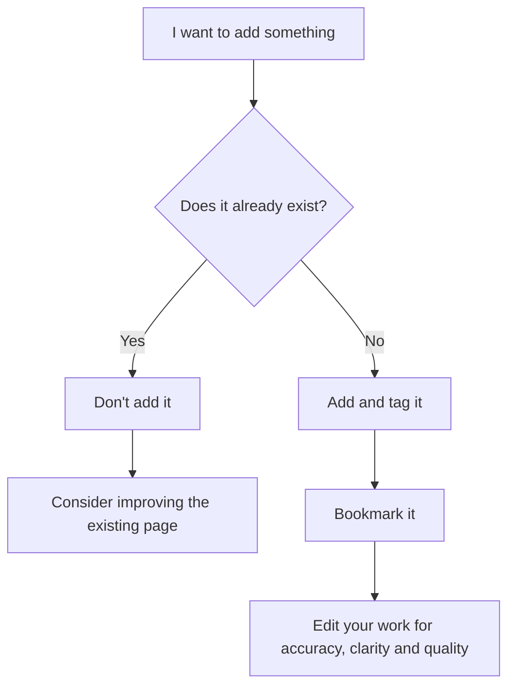

# Contribute

We welcome all kinds of contributions to the Ubuntu wiki.

> Editing of some content is restricted.
> For example, editing the homepage requires admin access.
{.is-info}


## Prerequisites

### Option 1

You are registered as a user with the Ubuntu wiki and are logged in.

This allows you to edit wiki pages directly.

> Choose the markdown editor if creating a new page.
{.is-warning}

### Option 2

You have a GitHub account and are logged in.

You can then click `Edit on GitHub`, which will open the page for editing in GitHub.

> Users will have their account deleted for any repeated indiscretions.
{.is-danger}

## Example contributions

* Fixing errors
* Updating content
* Creating pages
* Adding tags

## Types of content

The wiki accepts any content that is broadly **interesting** or **useful** to the Ubuntu community.

This could include:

* Technical how-to guides and tutorials
* Technical explanations and references
* Case-studies of Ubuntu usage
* Small tips and hacks

The content is not restricted to engineering topics. 
If you are interested in other topics, like design or art, your contributions are also welcome.

## What content is suitable for the wiki?

Here is how you might approach answering this question.



## Checklist for new pages

- [x] I have a wiki account **_OR_** I have a GitHub account
- [x] I am logged in
- [x] The page doesn't already exist on the wiki or in the official documentation
- [x] I have followed the [Diataxis](/documentation/diataxis) model, if appropriate
- [x] I have reviewed and edited the page for correctness and accuracy

## The Ubuntu wiki on CODA

Ubuntu Desktop is a project on the [Canonical Open Documentation Academy](https://github.com/canonical/open-documentation-academy).

Find issues with the `desktop` label:


## Kroki

```kroki
mermaid

graph TD
  A[ Anyone ] -->|Can help | B( Go to github.com/yuzutech/kroki )
  B --> C{ How to contribute? }
  C --> D[ Reporting bugs ]
  C --> E[ Sharing ideas ]
  C --> F[ Advocating ]
```