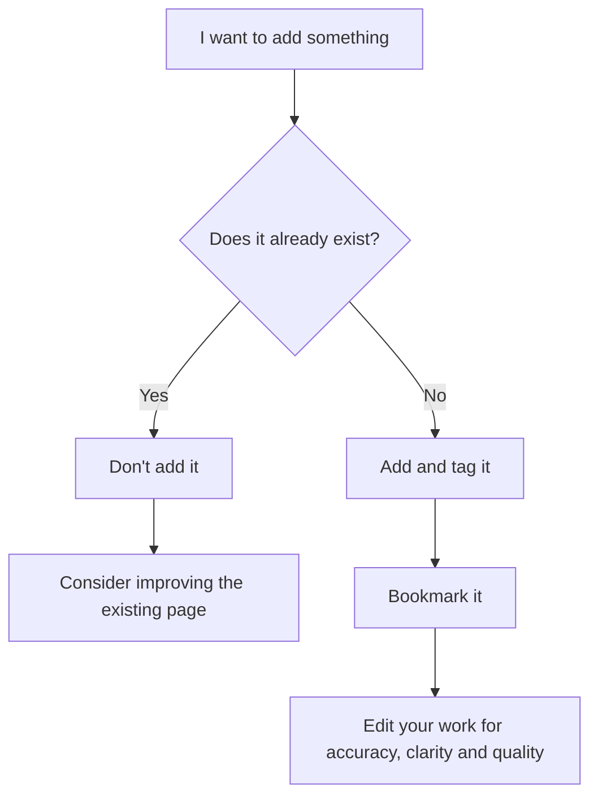

# Contribute

We welcome all kinds of contributions to the Ubuntu wiki.

## Example contributions

* Fixing errors
* Updating content
* Creating pages

## Types of content

The wiki accepts any content that is broadly **interesting** or **useful** to the Ubuntu community.

This could include:

* Technical how-to guides and tutorials
* Technical explanations and references
* Case-studies of Ubuntu usage
* Small tips and hacks

The content is not restricted to engineering topics. 
If you are interested in other topics, like design or art, your contributions are also welcome.

## What content is suitable for the wiki?

Here is how you might approach answering this question.

## Checklist for new pages

- [x] I have an account and am logged in
- [x] The page doesn't already exist
- [x] I have followed the [Diataxis](/documentation/diataxis) model during writing
- [x] I have reviewed and edited the page for correctness and accuracy

